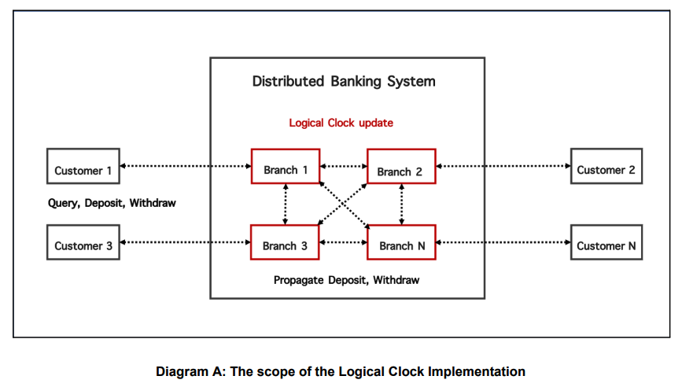
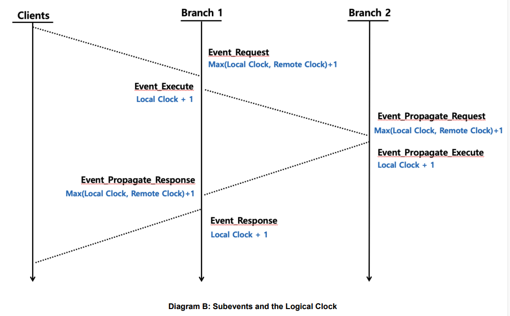

# Lamport’s Logical Clock on a gRPC-based Distributed Banking Simulator
<br>

 Simulate a distributed banking system that allows customers to withdraw or deposit money from multiple branches in the bank. The system is able to process concurrent updates on the same resources (money) in the bank, but a single customer is not allowed to access multiple branches at the same time. Each branch maintains a replica of the money that needs to be consistent with the replicas in other branches. The customer communicates with only a specific branch that has the same unique ID as the customer. Although each customer independently updates a specific replica, the replicas stored in each branch need to reflect all the updates made by the customer.

<br>

In this simulation, the branches are connected to each other and are expected to propagate (via gRPC channels) all **deposit** and **withdraw** transactions from the customers. 
A customer has a unique **ID** which matches a one of the branches in this distributed system. Customers are also allowed to query for a balance (which is expected to be in sync across all branches).




<br>

Each event (Deposit and Withdraw) has a unique ID, and the sub-interfaces follow a specific order. In order to mantain
the order of events in this distributed system, we will implement [Lamport’s logical clock algorithm](https://en.wikipedia.org/wiki/Lamport_timestamp) to maintain the
happens-before order of the sub events that have the same unique ID, and of all the events
on the same process.

<br>



<br>

gRPC server and client code have been generated utilizing the protocol buffer compiler and the **banking.proto** file


```
python -m grpc_tools.protoc -I. --python_out=. --grpc_python_out=. banking.proto
```

<br>


To test run the system, `cd` into the repository directory and run the following command:<br> `python -m main`
<br><br>
#### **Example output** (test_input_output.py file):

_Note: this project is a fork of my previous project [gRPCDistributedBankingSimulator](https://github.com/navarro165/gRPCDistributedBankingSimulator) 
so the sample output here will focus mostly on demonstrating Lamport's algorithm_.

```
Lamports-Logical-Clock git:(master) ✗ python -m main        
Collecting input data...

Branch Processes:
        {'id': 1, 'type': 'branch', 'balance': 400}
        {'id': 2, 'type': 'branch', 'balance': 400}
        {'id': 3, 'type': 'branch', 'balance': 400}

Customer Processes:
        {'id': 1, 'type': 'customer', 'events': [{'id': 1, 'interface': 'query', 'money': 400}]}
        {'id': 2, 'type': 'customer', 'events': [{'id': 2, 'interface': 'deposit', 'money': 170}, {'id': 3, 'interface': 'query', 'money': 400}]}
        {'id': 3, 'type': 'customer', 'events': [{'id': 4, 'interface': 'withdraw', 'money': 70}, {'id': 5, 'interface': 'query', 'money': 400}]}

Starting branch processes...
        - Server started, listening on 50051
        - Server started, listening on 50052
        - Server started, listening on 50053

Branch balances (initial balance):
        - id: 1, balance: 400
        - id: 2, balance: 400
        - id: 3, balance: 400

... STARTING CUSTOMER EVENTS ...

*** Branch 1 received query request... Balance is $400

event 1: {'id': 2, 'name': 'deposit_request', 'clock': 1}
event 2: {'id': 2, 'name': 'deposit_execute', 'clock': 2}
event 3: {'id': 2, 'name': 'deposit_propagate_request', 'clock': 3}
event 4: {'id': 2, 'name': 'deposit_propagate_execute', 'clock': 4}
event 5: {'id': 2, 'name': 'deposit_propagate_response', 'clock': 5}
event 3: {'id': 2, 'name': 'deposit_propagate_request', 'clock': 6}
event 4: {'id': 2, 'name': 'deposit_propagate_execute', 'clock': 7}
event 5: {'id': 2, 'name': 'deposit_propagate_response', 'clock': 8}

*** Branch 2 received query request... Balance is $570.0

event 1: {'id': 4, 'name': 'withdraw_request', 'clock': 8}
event 2: {'id': 4, 'name': 'withdraw_execute', 'clock': 9}
event 3: {'id': 4, 'name': 'withdraw_propagate_request', 'clock': 10}
event 4: {'id': 4, 'name': 'withdraw_propagate_execute', 'clock': 11}
event 5: {'id': 4, 'name': 'withdraw_propagate_response', 'clock': 12}
event 3: {'id': 4, 'name': 'withdraw_propagate_request', 'clock': 13}
event 4: {'id': 4, 'name': 'withdraw_propagate_execute', 'clock': 14}
event 5: {'id': 4, 'name': 'withdraw_propagate_response', 'clock': 15}

*** Branch 3 received query request... Balance is $500.0


... FINISHED CUSTOMER EVENTS ...

Waiting 3 sec before wrapping up...

Branch balances (final balance):
        - id: 1, balance: 500.0
        - id: 2, balance: 500.0
        - id: 3, balance: 500.0

Output:
[
    {
        "id": 1,
        "data": [
            {
                "id": 2,
                "name": "deposit_propagate_request",
                "clock": 3
            },
            {
                "id": 2,
                "name": "deposit_propagate_execute",
                "clock": 4
            },
            {
                "id": 4,
                "name": "withdraw_propagate_request",
                "clock": 10
            },
            {
                "id": 4,
                "name": "withdraw_propagate_execute",
                "clock": 11
            }
        ]
    },
    {
        "id": 2,
        "data": [
            {
                "id": 2,
                "name": "deposit_request",
                "clock": 1
            },
            {
                "id": 2,
                "name": "deposit_execute",
                "clock": 2
            },
            {
                "id": 2,
                "name": "deposit_propagate_response",
                "clock": 5
            },
            {
                "id": 2,
                "name": "deposit_propagate_response",
                "clock": 8
            },
            {
                "id": 4,
                "name": "withdraw_propagate_request",
                "clock": 13
            },
            {
                "id": 4,
                "name": "withdraw_propagate_execute",
                "clock": 14
            }
        ]
    },
    {
        "id": 3,
        "data": [
            {
                "id": 2,
                "name": "deposit_propagate_request",
                "clock": 6
            },
            {
                "id": 2,
                "name": "deposit_propagate_execute",
                "clock": 7
            },
            {
                "id": 4,
                "name": "withdraw_request",
                "clock": 8
            },
            {
                "id": 4,
                "name": "withdraw_execute",
                "clock": 9
            },
            {
                "id": 4,
                "name": "withdraw_propagate_response",
                "clock": 12
            },
            {
                "id": 4,
                "name": "withdraw_propagate_response",
                "clock": 15
            }
        ]
    },
    {
        "eventid": 2,
        "data": [
            {
                "name": "deposit_request",
                "clock": 1
            },
            {
                "name": "deposit_execute",
                "clock": 2
            },
            {
                "name": "deposit_propagate_request",
                "clock": 3
            },
            {
                "name": "deposit_propagate_execute",
                "clock": 4
            },
            {
                "name": "deposit_propagate_response",
                "clock": 5
            },
            {
                "name": "deposit_propagate_request",
                "clock": 6
            },
            {
                "name": "deposit_propagate_execute",
                "clock": 7
            },
            {
                "name": "deposit_propagate_response",
                "clock": 8
            }
        ]
    },
    {
        "eventid": 4,
        "data": [
            {
                "name": "withdraw_request",
                "clock": 8
            },
            {
                "name": "withdraw_execute",
                "clock": 9
            },
            {
                "name": "withdraw_propagate_request",
                "clock": 10
            },
            {
                "name": "withdraw_propagate_execute",
                "clock": 11
            },
            {
                "name": "withdraw_propagate_response",
                "clock": 12
            },
            {
                "name": "withdraw_propagate_request",
                "clock": 13
            },
            {
                "name": "withdraw_propagate_execute",
                "clock": 14
            },
            {
                "name": "withdraw_propagate_response",
                "clock": 15
            }
        ]
    }
]

```
