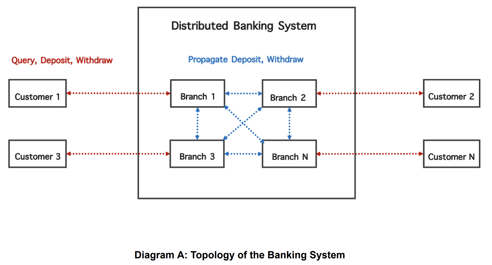

# gRPC Distributed Banking Simulator
<br>

 Simulate a distributed banking system that allows customers to withdraw or deposit money from multiple branches in the bank. The system is able to process concurrent updates on the same resources (money) in the bank, but a single customer is not allowed to access multiple branches at the same time. Each branch maintains a replica of the money that needs to be consistent with the replicas in other branches. The customer communicates with only a specific branch that has the same unique ID as the customer. Although each customer independently updates a specific replica, the replicas stored in each branch need to reflect all the updates made by the customer.

<br>

In this simulation, the branches are connected to each other and are expected to propagate (via gRPC channels) all **deposit** and **withdraw** transactions from the customers. 
A customer has a unique **ID** which matches a one of the branches in this distributed system. Customers are also allowed to query for a balance (which is expected to be in sync across all branches).




<br>

<br>

gRPC server and client code have been generated utilizing the protocol buffer compiler and the **banking.proto** file


```
python -m grpc_tools.protoc -I. --python_out=. --grpc_python_out=. banking.proto
```

<br>


To test run the system, `cd` into the repository directory and run the following command:<br> `python -m main`
<br><br>
**Example output** (test_input_output.py file):

```
Collecting input data...
	{'id': 1, 'type': 'branch', 'balance': 400}
	{'id': 2, 'type': 'branch', 'balance': 400}
	{'id': 3, 'type': 'branch', 'balance': 400}

Customer Processes:
	{'id': 1, 'type': 'customer', 'events': [{'id': 1, 'interface': 'query', 'money': 400}]}
	{'id': 2, 'type': 'customer', 'events': [{'id': 2, 'interface': 'deposit', 'money': 170}, {'id': 3, 'interface': 'query', 'money': 400}]}
	{'id': 3, 'type': 'customer', 'events': [{'id': 4, 'interface': 'withdraw', 'money': 70}, {'id': 5, 'interface': 'query', 'money': 400}]}

Starting branch processes...
	- Server started, listening on 50051
	- Server started, listening on 50052
	- Server started, listening on 50053


Branch balances (initial balance):
	- id: 1, balance: 400
	- id: 2, balance: 400
	- id: 3, balance: 400


... STARTING CUSTOMER EVENTS ...


Branch balances (final balance):
	- id: 1, balance: 500.0
	- id: 2, balance: 500.0
	- id: 3, balance: 500.0


########################
	OUTPUT:
########################

[{'id': 1,
  'recv': [{'interface': 'query', 'money': 500.0, 'result': 'success'}]},
 {'id': 2,
  'recv': [{'interface': 'deposit', 'result': 'success'},
           {'interface': 'query', 'money': 500.0, 'result': 'success'}]},
 {'id': 3,
  'recv': [{'interface': 'withdraw', 'result': 'success'},
           {'interface': 'query', 'money': 500.0, 'result': 'success'}]}]
```

<br>

For debugging, run the command with the `--debug` flag::<br> `python -m main --debug`
<br><br>
**Example output** (test_input_output.py file):

```
> python -m main --debug
Collecting input data...

Branch Processes:
	{'id': 1, 'type': 'branch', 'balance': 400}
	{'id': 2, 'type': 'branch', 'balance': 400}
	{'id': 3, 'type': 'branch', 'balance': 400}

Customer Processes:
	{'id': 1, 'type': 'customer', 'events': [{'id': 1, 'interface': 'query', 'money': 400}]}
	{'id': 2, 'type': 'customer', 'events': [{'id': 2, 'interface': 'deposit', 'money': 170}, {'id': 3, 'interface': 'query', 'money': 400}]}
	{'id': 3, 'type': 'customer', 'events': [{'id': 4, 'interface': 'withdraw', 'money': 70}, {'id': 5, 'interface': 'query', 'money': 400}]}

Starting branch processes...
	- Server started, listening on 50051
	- Server started, listening on 50052
	- Server started, listening on 50053


Branch balances (initial balance):
	- id: 1, balance: 400
	- id: 2, balance: 400
	- id: 3, balance: 400


... STARTING CUSTOMER EVENTS ...


Executing customer 1 events...


	###################
	##### QUERY #####
	###################
	> branch 1 received query from customer 1
	> branch 1 balance is $400
	^ CUSTOMER 1 CONFIRMS THAT BRANCH 1 HAS BALANCE OF 400.0


Executing customer 2 events...


	###################
	##### DEPOSIT #####
	###################
	> branch 2 received deposit from customer 2 for the amount of: $ 170.0

	******************************************************************
	*** Propagating branch 2 deposit of $170.0 to branches [1, 3] ***

	> branch 1 received deposit from branch 2 for the amount of: $ 170.0
	> branch 1 balance is $570.0
	< branch 2 confirms that branch 1 has new balance of 570.0

	> branch 3 received deposit from branch 2 for the amount of: $ 170.0
	> branch 3 balance is $570.0
	< branch 2 confirms that branch 3 has new balance of 570.0
	******************************************************************
	^ CUSTOMER 2 CONFIRMS THAT BRANCH 2 HAS NEW BALANCE OF 570.0


	###################
	##### QUERY #####
	###################
	> branch 2 received query from customer 2
	> branch 2 balance is $570.0
	^ CUSTOMER 2 CONFIRMS THAT BRANCH 2 HAS BALANCE OF 570.0


Executing customer 3 events...


	###################
	##### WITHDRAW #####
	###################
	> branch 3 received withdraw from customer 3 for the amount of: $ 70.0

	******************************************************************
	*** Propagating branch 3 withdraw of $70.0 to branches [1, 2] ***

	> branch 1 received withdraw from branch 3 for the amount of: $ 70.0
	> branch 1 balance is $500.0
	< branch 3 confirms that branch 1 has new balance of 500.0

	> branch 2 received withdraw from branch 3 for the amount of: $ 70.0
	> branch 2 balance is $500.0
	< branch 3 confirms that branch 2 has new balance of 500.0
	******************************************************************
	^ CUSTOMER 3 CONFIRMS THAT BRANCH 3 HAS NEW BALANCE OF 500.0


	###################
	##### QUERY #####
	###################
	> branch 3 received query from customer 3
	> branch 3 balance is $500.0
	^ CUSTOMER 3 CONFIRMS THAT BRANCH 3 HAS BALANCE OF 500.0


Waiting 3 sec before wrapping up...


Branch balances (final balance):
	- id: 1, balance: 500.0
	- id: 2, balance: 500.0
	- id: 3, balance: 500.0


########################
	OUTPUT:
########################

[{'id': 1,
  'recv': [{'interface': 'query', 'money': 500.0, 'result': 'success'}]},
 {'id': 2,
  'recv': [{'interface': 'deposit', 'result': 'success'},
           {'interface': 'query', 'money': 500.0, 'result': 'success'}]},
 {'id': 3,
  'recv': [{'interface': 'withdraw', 'result': 'success'},
           {'interface': 'query', 'money': 500.0, 'result': 'success'}]}]


```